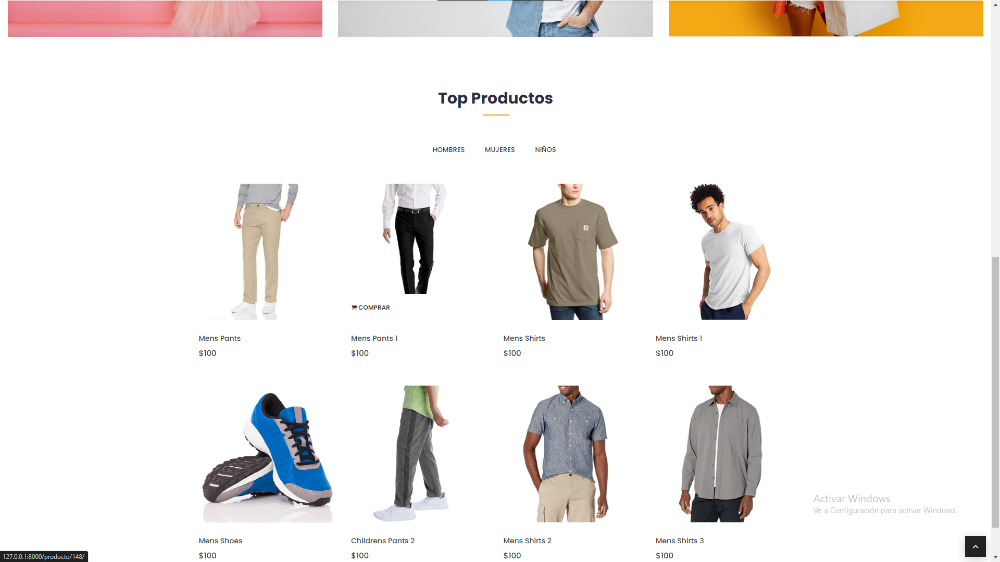
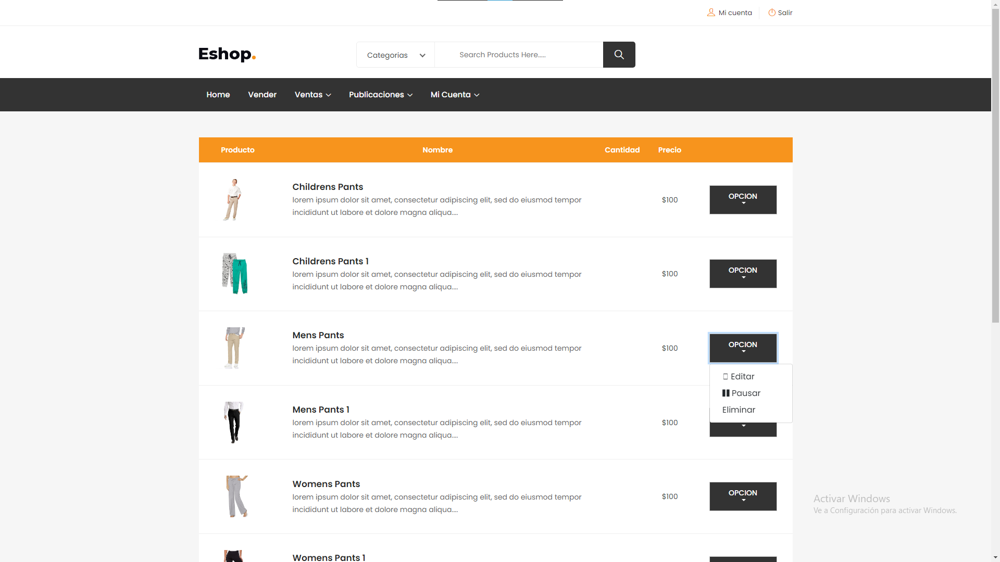
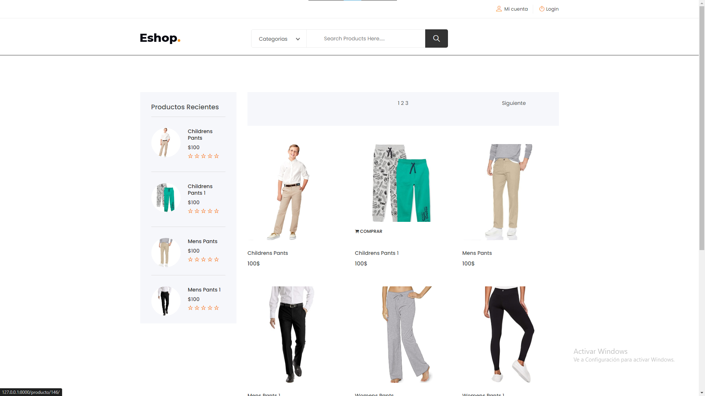
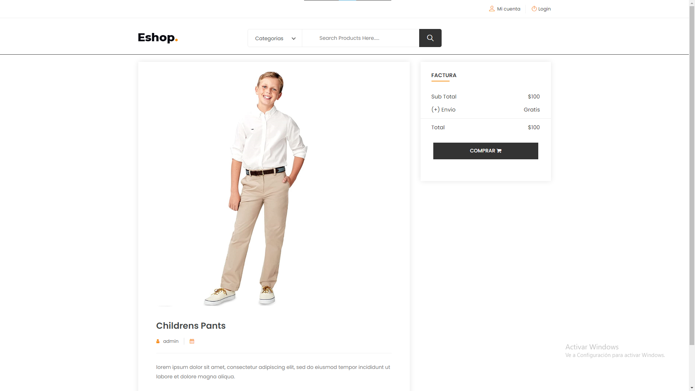
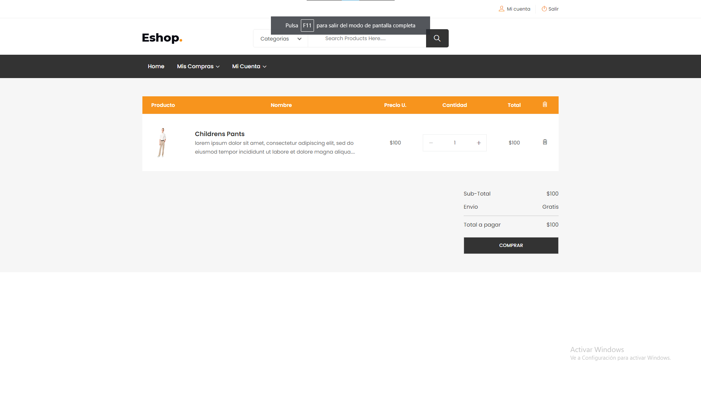
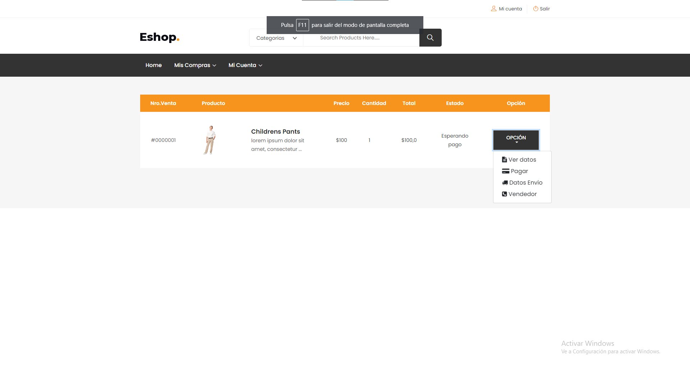
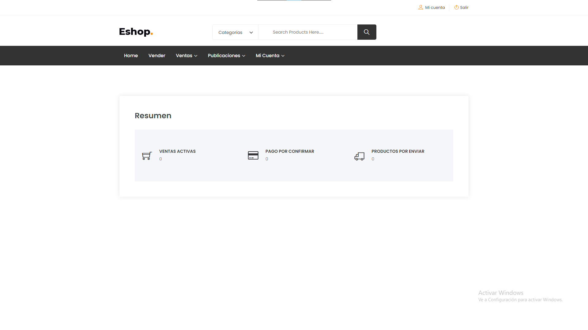
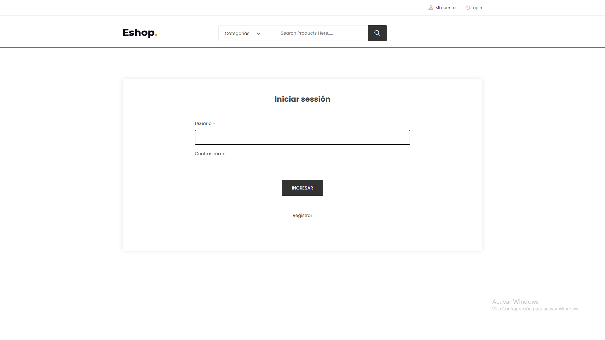
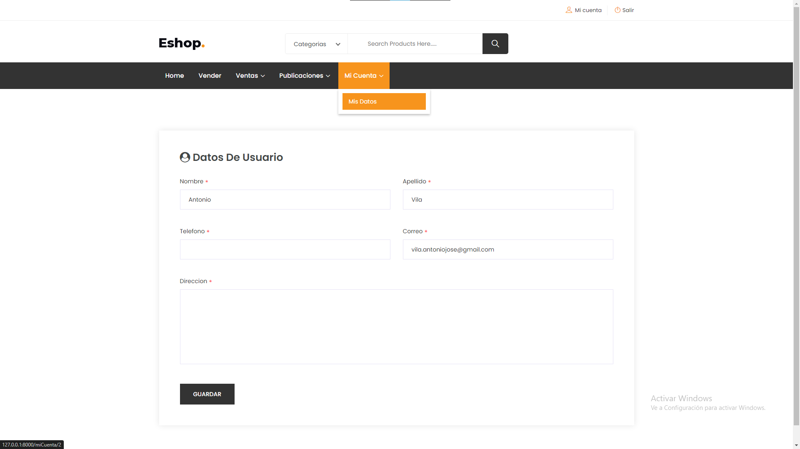

# Proyecto E-commerce Multivendedor


¡Bienvenido al Proyecto E-commerce Multivendedor!

Este proyecto es una demostración de mi trabajo en el desarrollo de una plataforma de comercio electrónico basada en Django, diseñada para soportar múltiples vendedores y ofrecer una experiencia de usuario fluida y segura.


## Características Principales

- **Autenticación y Roles de Usuario**: El sistema cuenta con un robusto sistema de autenticación que permite a los usuarios registrarse como vendedores o compradores, cada uno con sus propios privilegios y permisos.

- **Gestión de Productos**: Los vendedores pueden añadir, modificar y eliminar productos desde su panel de control, mientras que los compradores pueden explorar y comprar productos fácilmente desde la plataforma.

- **Estado de Operación**: Cada transacción cuenta con un estado de operación detallado, que informa a los usuarios sobre el progreso de su pedido, desde la confirmación del pago hasta la entrega del producto.

- **Pagos P2P**: El sistema soporta pagos peer-to-peer (P2P), lo que permite a los usuarios realizar transacciones seguras directamente entre ellos.

## Instalación

Para ejecutar este proyecto en tu entorno local, sigue estos pasos:

1. Clona este repositorio en tu máquina local.
   ```bash
   git clone https://github.com/tu_usuario/tu_proyecto.git

2. Navega hasta el directorio del proyecto.
   ```bash
   cd Django-Ecommerce

3. Instala las dependencias necesarias
   ```bash
   pip install -r requirements/requirements.txt

4. Copia el archivo `env.template` y renómbralo a `.env`.
   ```bash
   cp env.template .env

5. Abre el archivo .env en un editor de texto y proporciona los valores adecuados para cada variable según tu entorno de desarrollo.

6. Realiza las migraciones de la base de datos.
   ```bash
   python manage.py migrate

7. Inicializa el proyecto con datos de demostración (opcional).
   ```bash
   python manage.py initialize_project

8. Inicia el servidor de desarrollo
   ```bash
   python manage.py runserver


## Capturas de Pantalla

A continuación, algunas capturas de pantalla que muestran las principales vistas de la plataforma:














## Contribuciones

¡Las contribuciones son bienvenidas! Si deseas mejorar este proyecto, siéntete libre de enviar un pull request o abrir un issue para discutir nuevas características o mejoras.

## Contacto

Si tienes alguna pregunta o sugerencia, no dudes en ponerte en contacto conmigo a través de [vila.antoniojose@gmail.com](mailto:vila.antoniojose@gmail.com).

¡Gracias por tu interés en mi trabajo
